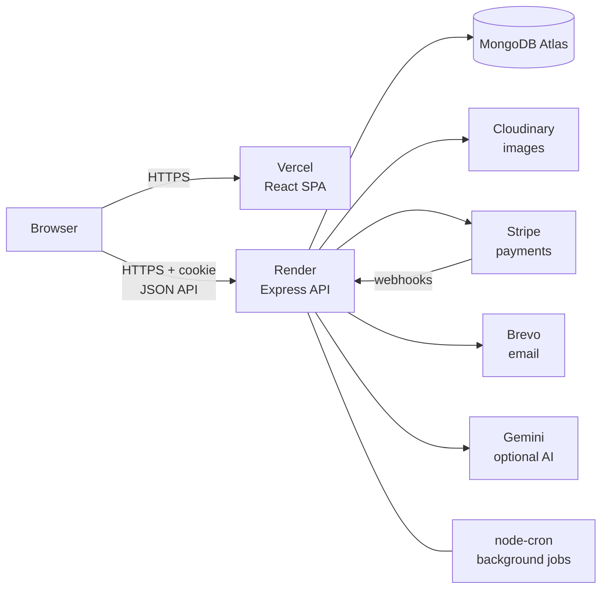
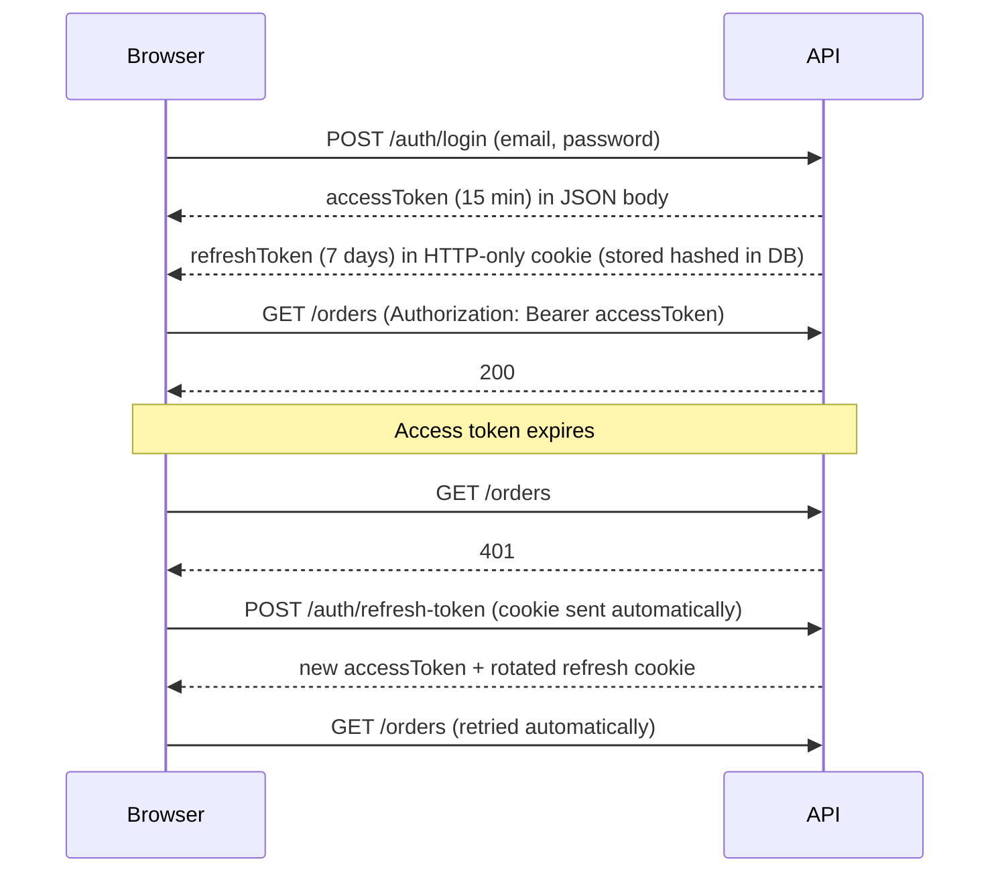
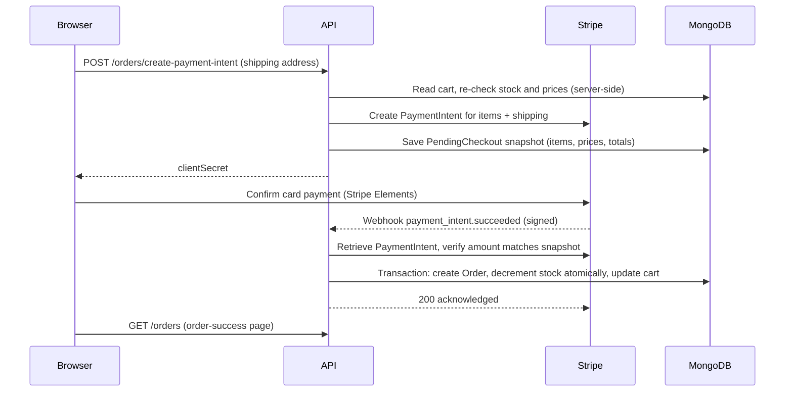
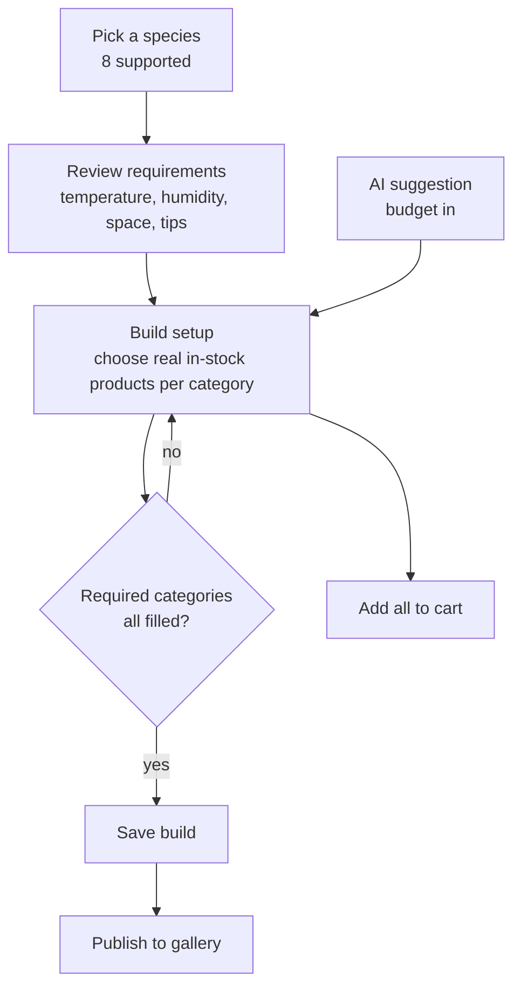
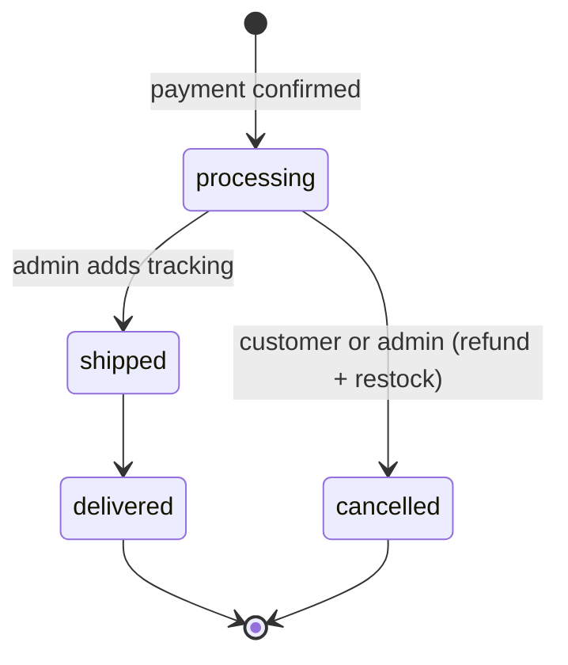
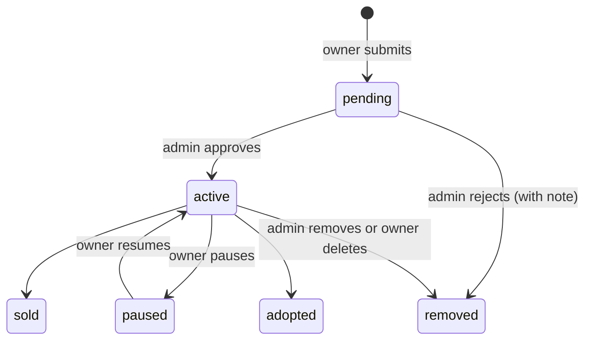
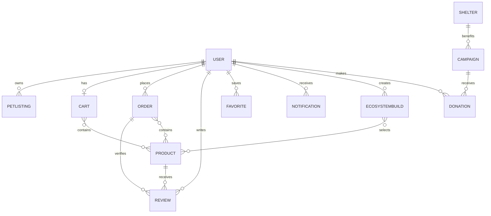

# PetCenter

**One platform for adopting pets, buying pet supplies, designing species-correct habitats, and funding animal rescue.**

PetCenter is a full-stack web application that brings the whole pet journey into a single, trustworthy place: find a pet (or rehome one), shop vet-reviewed supplies, build a complete habitat for the animal you are bringing home, and donate to the shelters that care for animals in need.

| | |
|---|---|
| **Live site** | https://pet-center-ten.vercel.app |
| **Live API** | https://petcenter-api.onrender.com (health check: `/api/v1/health`) |
| **Frontend** | React 19 + Vite, hosted on Vercel |
| **Backend** | Node.js + Express 5 + MongoDB (Atlas), hosted on Render |
| **Payments** | Stripe (test mode by default) |

> The API runs on Render's free tier, so the first request after a period of inactivity can take about a minute while the server wakes up.

---

## Table of Contents

1. [About the project](#1-about-the-project)
2. [Who benefits](#2-who-benefits)
3. [Features at a glance](#3-features-at-a-glance)
4. [Roles and permissions](#4-roles-and-permissions)
5. [Tech stack](#5-tech-stack)
6. [System architecture and how it works](#6-system-architecture-and-how-it-works)
7. [Feature walkthrough (A to Z)](#7-feature-walkthrough-a-to-z)
8. [Data model](#8-data-model)
9. [Security and reliability](#9-security-and-reliability)
10. [Project structure](#10-project-structure)
11. [Getting started (local development)](#11-getting-started-local-development)
12. [Environment variables](#12-environment-variables)
13. [API reference](#13-api-reference)
14. [Frontend routes](#14-frontend-routes)
15. [Testing](#15-testing)
16. [CI/CD](#16-cicd)
17. [Deployment (Render + Vercel)](#17-deployment-render--vercel)
18. [Operations and troubleshooting](#18-operations-and-troubleshooting)
19. [Known limitations and roadmap](#19-known-limitations-and-roadmap)
20. [Contributing](#20-contributing)
21. [Glossary](#21-glossary)

---

## 1. About the project

### The problem

Someone bringing a new animal home today usually has to stitch together four different services:

- a classifieds site or shelter website to **find** the animal,
- a general e-commerce store to **buy** supplies, with no way to know whether a tank, heater and filter actually work together for that species,
- forums and blog posts to learn what the **habitat** must look like (temperature, humidity, lighting, space),
- and, separately, a way to **give back** to rescues.

Information is scattered, supply lists are guesswork, and listings carry little trust signalling.

### The solution

PetCenter combines all four into one product with a shared account, cart, notification system and admin console:

| Pillar | What it does |
|---|---|
| **Pet Marketplace** | Verified, moderated listings for adoption and sale, with contact details protected behind a login. |
| **Supplies Store** | A catalogue with filtering, a stock-aware cart, Stripe checkout, order tracking and verified-purchase reviews. |
| **Ecosystem (Habitat) Builder** | A guided wizard that assembles every essential a species needs from real, in-stock store products, with an optional AI assistant. |
| **Donations and Shelters** | A directory of partner shelters and time-boxed fundraising campaigns paid through Stripe. |

### Design principles

- **Trust first.** Listings are reviewed before they go live, contact details are not scraper-friendly, reviews require a verified purchase, and shelters can be marked verified.
- **The server is the source of truth.** Prices, stock, totals, ownership and permissions are all enforced on the server; the client is never trusted for money.
- **Never fabricate data.** Stats, ratings and recommendations come from real records. The AI layer can only describe products the system already selected; it cannot invent any.
- **Degrade gracefully.** Optional services (Google sign-in, AI narration, email) switch off cleanly when not configured instead of breaking the app.

---

## 2. Who benefits

| Stakeholder | How they benefit |
|---|---|
| **Adopters and pet buyers** | One place to browse moderated listings with health notes, temperament and fees shown upfront; save favourites; contact owners safely. |
| **Pet owners and rehomers (sellers)** | A simple way to list an animal, track views, saves and enquiries, pause or mark it adopted or sold, and be notified when moderators act on a listing. |
| **Shelters and rescues** | Public profiles with verified badges, needs lists, and active fundraising campaigns that link donors straight to them. |
| **Donors** | Transparent campaigns (goal, amount raised, donor wall, deadline), anonymous or named giving, and a personal donation history. |
| **Supply customers** | Stock-aware cart, honest shipping rules, live order timeline with tracking, easy cancellation with refund, and reviews written only by real buyers. |
| **First-time and exotic-pet keepers** | The Habitat Builder tells them exactly what each of 8 species needs, flags required versus optional items, and checks compatibility so nothing arrives half-complete. |
| **Administrators and moderators** | A single console to moderate listings, manage the catalogue, orders, campaigns, shelters and reviews, and watch revenue and activity trends. |
| **The animals themselves** | Safer rehoming through moderation, correct habitats through guided setup, and more funding reaching the rescues that look after them. |

---

## 3. Features at a glance

**Accounts**
- Email and password registration and login, plus Google sign-in
- Short-lived access tokens with rotating, hashed refresh tokens in an HTTP-only cookie
- Forgot and reset password by email, change password, profile and photo
- Block, unblock and soft-delete users (admin)

**Pet marketplace**
- Search and filter by species, listing type, gender, price and location
- Listing detail with health and wellness info and a "listed by" profile
- Login-gated contact reveal (rate limited to deter scraping)
- Create, edit, pause, resume, mark sold or adopted, delete
- Admin moderation queue: approve, reject with a note, remove
- Per-listing views, saves and enquiries counters

**Supplies store**
- Category, pet, price, stock, tag and text-search filtering; sorting; pagination
- Product detail with gallery, related products and star ratings
- Verified-purchase reviews with a rating distribution chart
- Persistent cart with stock checks and price snapshots

**Checkout and orders**
- Stripe PaymentIntent checkout with server-computed totals and shipping
- Orders created from a checkout snapshot (cannot drift from what was charged)
- Order history, detail page, status timeline, tracking number and carrier
- Customer cancellation with automatic Stripe refund and stock restoration
- Admin status management

**Ecosystem Habitat Builder**
- 8 species profiles with care tips and habitat requirements
- Step-by-step wizard, live running total, required-item tracking
- Save builds, publish to a public gallery, clone other people's builds
- Add an entire build to the cart in one action
- AI Habitat Assistant: budget-aware starter build plus an optional AI-written explanation

**Donations**
- Fundraising campaigns with goal, progress, deadline and a donors wall
- One-time Stripe donations, anonymous or signed in
- Automatic reconciliation of missed payment webhooks

**Community and engagement**
- Favourites for both pets and products
- In-app notifications with a live unread badge
- Platform feedback and curated homepage testimonials

**Administration**
- Overview dashboard with weekly trend cards and 30-day charts
- Management consoles for users, listings, products, orders, campaigns, donations, shelters, ecosystem builds and reviews

**Engineering**
- 295 automated tests across 39 files
- GitHub Actions CI, a one-click Render Blueprint, Vercel single-page-app configuration
- Fail-fast production configuration checks

---

## 4. Roles and permissions

| Capability | Visitor | Signed-in user | Admin |
|---|:---:|:---:|:---:|
| Browse listings, products, shelters, campaigns, gallery | Yes | Yes | Yes |
| Use the Habitat Builder and AI suggestion | Yes | Yes | Yes |
| Donate to a campaign | Yes (anonymous) | Yes | Yes |
| Reveal listing or shelter contact details | No | Yes | Yes |
| Use cart, checkout, orders, favourites, notifications | No | Yes | Yes |
| Create and manage **own** listings | No | Yes | Yes |
| Save, publish and clone ecosystem builds | No | Yes | Yes |
| Review a product | No | Only after a delivered order containing it | Same |
| Submit platform feedback | No | Yes | Yes |
| Moderate listings, reviews and ecosystem builds | No | No | Yes |
| Manage products, orders, campaigns, shelters, donations | No | No | Yes |
| Block, unblock or delete users | No | No | Yes (cannot target other admins) |

Ownership is always re-checked on the server: a user can only edit, delete, pause or change the status of **their own** listings, builds, reviews and notifications, regardless of what the client sends.

---

## 5. Tech stack

### Frontend (`Client/`)

| Concern | Technology |
|---|---|
| UI library | React 19 |
| Build tool and dev server | Vite 8 |
| Routing | React Router 7 |
| Styling | Tailwind CSS 4 (with the official Vite plugin) |
| Animation | Framer Motion 12 |
| Icons | Lucide React |
| HTTP client | Axios 1.x with request and refresh interceptors |
| Payments UI | `@stripe/stripe-js`, `@stripe/react-stripe-js` |
| Charts (admin) | Chart.js 4 with `react-chartjs-2` |
| Delight | `canvas-confetti`, small sound effects |
| State | React Context (Auth, Cart, Builder, Favorites, Notifications) |
| Quality | ESLint 9 (with react-hooks and react-refresh rules) |

### Backend (`Server/`)

| Concern | Technology |
|---|---|
| Runtime | Node.js 20 or newer (Render runs Node 22) |
| Framework | Express 5 |
| Database | MongoDB with Mongoose 9 (Atlas in production) |
| Authentication | JSON Web Tokens (`jsonwebtoken`), `bcryptjs`, Google Identity Services (`google-auth-library`) |
| Payments | Stripe SDK 22 (PaymentIntents, refunds, webhooks) |
| Image storage | Cloudinary via `multer` and `multer-storage-cloudinary` |
| AI narration | Google Gemini via `@google/genai` (optional) |
| Email | Brevo transactional HTTPS API, with `nodemailer` SMTP fallback |
| Scheduled jobs | `node-cron` |
| Security middleware | `helmet`, `cors`, `express-rate-limit`, a custom NoSQL sanitizer, `sanitize-html` |
| Other | `compression`, `cookie-parser`, `morgan`, `dotenv` |

### Quality, delivery and hosting

| Concern | Technology |
|---|---|
| Tests | Vitest 5, Supertest, `mongodb-memory-server` |
| CI | GitHub Actions |
| Backend hosting | Render (Blueprint in `render.yaml`) |
| Frontend hosting | Vercel (`Client/vercel.json`) |
| Database hosting | MongoDB Atlas |

### External services

| Service | Used for | Required? |
|---|---|---|
| MongoDB Atlas | Primary datastore (needs a replica set for transactions) | Yes |
| Stripe | Checkout and donation payments, refunds, webhooks | Yes |
| Cloudinary | Image uploads for listings, products, campaigns, shelters, avatars | Yes |
| Brevo | Password-reset email | Needed for email in production |
| Google Cloud (OAuth) | "Continue with Google" | Optional |
| Google AI Studio (Gemini) | AI habitat explanation | Optional |

---

## 6. System architecture and how it works

### High-level architecture



- The **React single-page app** is static files served by Vercel. All data comes from the API at `VITE_API_URL`.
- The **Express API** is stateless apart from an in-memory narration cache and rate-limit counters. All persistent state lives in MongoDB.
- **Stripe** talks to the API in two directions: the server creates PaymentIntents, and Stripe calls back with signed webhooks that actually create orders and credit donations.

### Request lifecycle

Every API request flows through the same pipeline in `Server/app.js`:

1. `helmet` (security headers) and `cors` (only origins listed in `CLIENT_URL`, credentials allowed)
2. Request logging (`morgan`) and gzip compression
3. **Stripe webhook route**, mounted *before* any body parser so signature verification sees the raw bytes
4. JSON and URL-encoded body parsers (10 MB limit), then `cookie-parser`
5. `nosqlSanitize`, which strips `$`-operator and dotted keys from the body and query
6. General rate limiter (100 requests per minute per IP)
7. The route's own middleware (`protect`, `adminOnly`, upload handlers, stricter limiters)
8. Controller, then the global error handler (which hides internal messages in production)

Every success response has the shape `{ "success": true, "data": ..., ...extras }`; every error is `{ "success": false, "message": "..." }`.

### Authentication flow



Key points:

- The **access token lives only in memory** (never `localStorage`), so injected scripts cannot read it. On page load the app silently exchanges the refresh cookie for a new one.
- The **refresh token is HTTP-only**, stored **hashed**, and **rotated** on every refresh, so a stolen old token stops working.
- Each user has a `tokenVersion`. Resetting or changing a password, or an admin deleting the account, bumps it, instantly invalidating every token already issued.
- The Axios interceptor queues concurrent requests during a refresh and retries them once, avoiding refresh storms.
- "Keep me signed in" decides between a 7-day cookie and a session-only cookie.

### Checkout and payment flow

This is the most safety-critical path in the system, so it is deliberately split into two halves joined by a snapshot.



Why it is built this way:

- **Totals are computed on the server** from live product data. A subtotal under $75 adds a flat $5.99 shipping fee; at or above $75 shipping is free. A single order is capped at $10,000, and a price that moved more than 5% since the item was added blocks checkout.
- **The order is built from the snapshot, not the live cart.** Without this, a user could pay for a small cart and then enlarge it before the webhook arrived. The webhook also verifies that `paymentIntent.amount` equals the snapshot total.
- **Stock is decremented atomically** with a conditional update (`stock >= qty`) inside a MongoDB transaction, so two buyers can never both take the last unit.
- **Webhooks are idempotent.** Duplicate deliveries, and a delivery that loses a race to another, resolve to the same single order instead of double-charging, double-refunding or double-crediting.
- **Failures refund automatically.** If an order cannot be fulfilled after payment (for example it sold out in the meantime), the payment is refunded.
- Errors inside webhook handlers are logged and still acknowledged with 200, so Stripe does not enter a retry storm over a bug in our own code. Requests with a missing or invalid signature are rejected with 401.

### Donation flow

1. The donor picks a campaign and amount (minimum $0.50). The API creates a PaymentIntent and a **pending** `Donation` row (the donor may be anonymous).
2. After payment, Stripe's `payment_intent.succeeded` webhook marks the donation **completed** and atomically increments the campaign's `raisedAmount` and `donorCount` inside one transaction. If the goal is reached the campaign becomes `goal_reached`.
3. If a webhook is ever missed, a **reconciliation job** runs every 15 minutes, asks Stripe directly about any donation still pending after 15 minutes, and completes or fails it.
4. Refunds (`charge.refunded`) reverse the totals and can re-open a campaign that falls back below its goal.

### Habitat Builder flow



Species profiles live in a static file (`Server/src/config/petConfig.js`); they are engineering knowledge that never changes at runtime. A product appears in a species' category when its `compatiblePets` includes the species and its `tags` include the category key. The server **re-validates** every saved selection (compatibility, category, per-category maximums, active and in stock), so a hand-crafted request cannot save an invalid build.

### Order status lifecycle



A cancelled order is final: it has already been refunded, so it cannot be "un-cancelled". Each transition is recorded in a timestamped `statusHistory` that powers the customer's timeline. `pending` also exists as an admin-settable state and is shown to customers as Processing.

### Listing lifecycle



Only `active` listings appear publicly. Owners are notified on approval, rejection and removal.

### Background jobs

Started with the server (`Server/src/config/scheduledJobs.js`):

| Schedule | Job | Purpose |
|---|---|---|
| Every 15 minutes | `reconcilePendingDonations` | Completes or fails donations whose webhook never arrived |
| Every 6 hours | `checkClosingCampaigns` | Notifies a campaign's creator once it enters its final 48 hours (once per deadline) |
| Daily at 03:00 | `cleanupStaleEcosystemDrafts` | Deletes empty, unpublished builds untouched for 30 days |

Database TTL indexes also expire carts untouched for 30 days and unclaimed checkout snapshots after 24 hours.

---

## 7. Feature walkthrough (A to Z)

### 7.1 Accounts and authentication

**Register.** Name, email, password (minimum 6 characters), phone and location. The account is created, a session starts immediately, and the role is always `user` (a role sent by the client is ignored).

**Log in.** Email and password. Blocked and deleted accounts are refused with a clear message. Failed logins return one generic "invalid email or password" message so the response never reveals whether an email exists.

**Continue with Google.** The browser obtains a Google ID token; the server verifies its signature and audience, then finds or creates the account. For safety it **refuses to silently link** a Google identity to an existing password account with the same email (that would allow account takeover); the user is asked to log in with their password instead.

**Forgot and reset password.** Requesting a reset always returns the same message whether or not the email exists. A single-use, 30-minute token is emailed (stored only as a hash). Using it sets the new password and signs the user out everywhere.

**Profile and settings.** Update name, phone and location; upload a profile photo (2 MB, cropped to a face-centred square); change password (which keeps the current session alive with a fresh token while invalidating all others); manage notification preferences.

**Sessions.** Silent refresh, rotation and logout as described in [the authentication flow](#authentication-flow). Auth endpoints are rate limited to 15 requests per 15 minutes per IP.

### 7.2 Pet marketplace

**Browse.** `/marketplace` lists only approved (`active`) listings with:
- species filter (dog, cat, bird, fish, reptile, other),
- listing type (for sale or for adoption), gender, price range, location,
- free-text search across title, breed and description,
- sorting (recently added, price low to high, price high to low) and pagination.

Filter and page state is kept in the URL, so views can be shared and survive a refresh.

**Listing detail.** Photo gallery, breed, age, gender, species, location, price or adoption fee, health and wellness notes, verification flags (Vaccinated, Spayed / Neutered, Microchipped, Habitat Included, House-trained), the owner's public profile, safety tips, and similar listings. A favourite heart is available to signed-in users.

**Contact reveal.** The owner's contact details are **not** in the public listing response at all. A signed-in user clicks "Reveal contact details"; the request is rate limited (20 per 15 minutes) so contacts cannot be bulk-harvested. Each reveal by someone other than the owner increments the listing's enquiry count. Owners see their own contact automatically.

**Posting a listing.** Signed-in users fill a form (title, species, breed, age in months, gender, price, location, description, health info, contact details, listing type, verification flags) and attach up to **5 images** (5 MB each; JPG, PNG or WebP; resized to fit 1200x900). A draft is auto-saved in the browser. The listing is created as `pending`.

**Moderation.** Admins see a queue. They can **approve** (the listing goes live and the owner is notified), **reject** with a note (the owner is notified with the reason) or **remove** an active listing.

**Managing your listings.** `/my-listings` shows every listing with status, views, saves and enquiries. Owners can edit (including removing individual images), **pause** a live listing so it disappears from the marketplace without re-moderation and **resume** it, mark it **sold** or **adopted**, or delete it (a soft delete, plus clean-up of its Cloudinary images).

### 7.3 Supplies store

**Browse and filter.** `/products` offers category (food, habitat, accessories, healthcare, cleaning, toys), compatible pet, price range, in-stock-only, tags and full-text search (name, description, brand), plus sorting (newest, price, bestsellers). Page size is capped server-side.

**Product detail.** Image gallery, price, stock level, brand, description, compatible pets, quantity picker, add to cart, favourite heart, four related products from the same category, and the reviews section.

**Soft delete.** Removing a product only deactivates it, so historical orders keep working while it disappears from the catalogue.

### 7.4 Cart

- Add, change quantity, remove and clear. Quantities must be positive whole numbers and cannot exceed stock; out-of-stock and inactive products are refused.
- The price is **snapshotted** when an item is added (`priceAtAdd`), so a later price change cannot silently alter what a customer expects to pay; checkout re-validates against live prices.
- The cart is stored server-side per user, so it follows the user across devices and expires after 30 idle days.
- **Bulk add** (used by the Habitat Builder) adds many products at once and reports exactly which were added and which failed, rather than failing the whole batch.
- The cart page shows shipping rules ("free over $75, otherwise $5.99"), a live order summary and clear error messages if an update fails.

### 7.5 Checkout and payments

Checkout is a protected three-step flow (cart, details and payment, success):

1. Enter a shipping address (name, address lines, city, country, postal code).
2. The server validates the cart again (stock, active products, price drift) and creates a Stripe PaymentIntent for exactly items plus shipping.
3. The customer pays with Stripe Elements. For testing use card `4242 4242 4242 4242`, any future expiry and any CVC.
4. Stripe's webhook creates the order (see [the checkout flow](#checkout-and-payment-flow)) and the user lands on the order-success page.

The payment-intent endpoint is rate limited because it creates billable objects at Stripe.

### 7.6 Orders

- **History** (`/orders`) with status filter and pagination.
- **Order detail** shows items with price at purchase, the shipping address, totals including shipping, payment status, and a **status timeline** (Processing, Shipped, Delivered) with real dates, plus tracking number and carrier once shipped.
- **Cancel.** A customer can cancel an order that is `pending` or `processing`. The order is marked cancelled and stock is restored in one transaction, then the Stripe refund is issued. (If the refund call fails after the database update, the user is told to contact support, so a transient error can never leave a refunded order looking active.)
- **Notifications.** Every status change notifies the customer in-app.
- **Admin.** Admins change status (adding tracking info when marking shipped), cancel with refund, filter by status and payment status, sort, and see revenue statistics. Illegal moves (for example reactivating a cancelled order) are rejected with an explanation.

### 7.7 Reviews and ratings

- A user can review a product **only if they own a delivered order containing it**; the order must belong to them, contain that exact product, and each order can be reviewed once per product.
- Rating 1 to 5 and an optional comment (500 characters, HTML stripped).
- Reviews can be **edited or deleted within 48 hours** of posting.
- The product's `averageRating` and `reviewCount` are recalculated after every create, edit, delete or hide.
- The product page shows the average, a 1 to 5 star **distribution chart**, sorting (newest, highest, lowest) and pagination.
- Low ratings (2 stars or less) notify admins; admins can hide abusive reviews, which removes them from the public rating.
- Curated 5-star reviews with comments feed the homepage testimonials.

### 7.8 Favourites

A heart on every listing and product card. Toggling is **optimistic** (instant) and reverts if the request fails; rapid double-clicks are serialised per item. A single batch "check" call lets list pages mark many hearts at once. `/favorites` shows saved pets and products in tabs. Duplicate favourites are impossible (unique index).

### 7.9 Notifications

A bell in the navbar shows an unread count that refreshes every 60 seconds. Notification types: listing approved, listing rejected, listing removed, order status changed, donation campaign closing, review received, and system messages. Users can open one, mark one read, mark all read, or delete. Users can only ever see and change their own.

### 7.10 Ecosystem (Habitat) Builder

The flagship feature. It turns "I want a pet snake" into a complete, compatible shopping list.

**Supported species (8):** Fish, Snake, Bird, Tarantula / Spider, Turtle, Mouse, Reptile (general) and Amphibian.

**Step 1: Pick a pet.** A grid of species with imagery and a one-line description, plus the AI suggestion box.

**Step 2: Review requirements.** Per-species guidance: minimum tank or enclosure size, temperature range, humidity range, lighting hours, UV requirement, and care tips ("cycle your tank for 4 to 6 weeks before adding fish"). The required and optional categories are previewed.

**Step 3: Build the setup.** Each species has its own categories. For fish: tank, filter and heater are **required**; thermometer, lighting, substrate, decorations (up to 4), air pump and water conditioner (up to 2) are optional. Each category shows real, in-stock store products that are compatible with the species. Sold-out items are visibly disabled. A sticky summary shows the live total, item count and a "still needed" list of missing required categories.

**Actions:**
- **Add all to cart** adds every selected item at once and reports any that failed (your selections are kept if nothing could be added).
- **Save build** stores it under a name (up to 60 characters) with price snapshots, so a saved build still reads correctly if a product later changes or is removed.
- **Publish** to the public gallery. Publishing requires every required category to be filled, and editing a published build cannot remove a required category.
- **Unpublish** at any time.

**Gallery.** `/ecosystem/gallery` shows published builds, filterable by species and sortable by newest or most cloned. Each build has a detail page. Signed-in users can **clone** a build into their own private builds (a deep copy; editing the clone never affects the original), and the original's clone count goes up.

**My builds.** A dashboard tab lists the user's builds with delete, publish and re-open actions.

**Admin moderation.** Admins can see all published builds and force-unpublish one that breaks guidelines.

#### AI Habitat Assistant

Two cooperating layers, deliberately separated so the AI can never recommend something that does not exist:

1. **Deterministic budget suggestion** (`POST /ecosystem/suggest`). Give a species and a budget; the server greedily assembles a starter build from real, in-stock, compatible products. Required categories are always filled (the best-rated option that fits, falling back to the cheapest even if that goes over budget), and optional categories are added only while budget remains. The result always states honestly whether it went over budget and why. No language model is involved at this step.
2. **Optional AI explanation** (`POST /ecosystem/narrate`). A short, friendly 2 to 3 sentence explanation of the *already chosen* items, written by Google Gemini (`gemini-flash-lite-latest`, capped at 200 tokens). The prompt contains only the real selected products and forbids mentioning anything else. Identical selections are cached, and **if no key is configured, the call fails, or the response is empty, a plain accurate sentence built from the real data is returned instead.** The "Explain this build" button describes your *current* selection, so it stays correct if you swap items after receiving a suggestion.

### 7.11 Donations and campaigns

**Campaigns** (`/campaigns`, `/campaigns/:id`) show a title, story, images, category (medical, shelter, food, rescue, rehabilitation, general), a progress bar toward the goal, amount raised, donor count, days left, the beneficiary shelter, and a **donor wall** of recent donors (anonymous donors appear as "Anonymous").

**Donating.** Pick or type an amount, optionally add a display name and message, and pay with Stripe. You do not need an account, but signed-in donations are linked to your history. You cannot donate to draft, expired, closed or goal-reached campaigns.

**Thank you.** `/thank-you` confirms the donation.

**Lifecycle (admin).** `draft` (invisible) to `active` (published) to `goal_reached`, `expired` (deadline passed) or `closed` (manually, with a required reason). Only drafts can be deleted. The goal cannot be changed after donations arrive. Rich-text descriptions are sanitised against a strict allow-list on the server.

**Impact.** The homepage "Where your donation goes" section surfaces active campaigns, and each user has a donation history tab.

### 7.12 Shelters

`/shelters` is a directory of partner shelters, rescues, rehabilitation centres, vet clinics and foster networks. Each profile shows logo, description, location, a **verified** badge, a "needs list" (for example blankets, food) and its active campaigns. Phone and email are hidden from public responses and only available through a signed-in, rate-limited "reveal contact" action. Admins create, edit, activate or deactivate, and delete shelters (a shelter linked to campaigns cannot be deleted).

### 7.13 Platform feedback and testimonials

Signed-in users can leave one piece of site feedback (a 1 to 5 rating and comment); resubmitting updates it rather than creating a duplicate. Feedback rated 4 or higher with a comment can appear publicly on the homepage, and 5-star or 1-star ratings alert admins.

### 7.14 User dashboard

`/dashboard` is a tabbed hub:

| Tab | Contents |
|---|---|
| Overview | Greeting and at-a-glance activity |
| Donations | Personal donation history with campaign progress |
| Habitat builds | Saved builds and gallery actions |
| Profile | Edit personal details and photo |
| Settings | Change password, notification preferences |

Orders (`/orders`) and saved items (`/favorites`) also have dedicated pages.

### 7.15 Admin console

Admins use `/admin`, a separate layout with a sidebar.

| Section | What admins can do |
|---|---|
| **Overview** | Cards for users, listings, products, orders, revenue, campaigns, donations and donation revenue, each with a week-over-week trend; 30-day charts for signups, orders, donations and revenue; low-stock, out-of-stock and top-selling products; a recent-activity timeline |
| **Users** | Search, block, unblock, soft-delete (blocked and deleted users lose access immediately; admins are protected) |
| **Listings** | Filter by status, approve, reject with a note, remove |
| **Products** | Create and edit with up to 8 images, adjust stock inline, soft-delete, search and filter |
| **Orders** | Filter, sort, update status, add tracking and carrier, cancel with refund, revenue statistics |
| **Campaigns** | Create, edit, publish, close with a reason, delete drafts, set featured order |
| **Donations** | Review all donations by status |
| **Shelters** | Create, edit, verify, activate, delete |
| **Ecosystem** | See published builds and force-unpublish |
| **Reviews** | Filter and hide inappropriate reviews |

### 7.16 Public pages and user experience

- **Home**: hero, value strip, featured pets, store preview, Habitat Builder spotlight, donation impact, partner shelters, how it works, trust section, newsletter sign-up section and live platform stats (pets rehomed, partner shelters, average rating) computed from real data.
- **About, Help Center, Safety Guidelines, Terms, Privacy and Contact** static pages.
- **404** and **Unauthorized** pages; an **error boundary** prevents a single component crash from blanking the app.
- Responsive layouts, skeleton loaders, toasts, route-level protection that never flashes protected content, Framer Motion transitions, confetti on success and subtle sound effects.

---

## 8. Data model

### Collections

| Collection | Purpose | Notable fields and rules |
|---|---|---|
| `User` | Accounts | `role` (user, admin), `authProvider` (local, google), hashed `password`, hashed `refreshToken`, `tokenVersion`, `isBlocked`, `isDeleted`, reset token (hashed) and expiry, notification preferences |
| `PetListing` | Marketplace listings | `status` (pending, active, paused, sold, adopted, removed), `listingType` (sale, adoption), images and Cloudinary ids, `verifiedFlags`, `contactDetails` (hidden from public reads), `viewCount`, `enquiriesCount`, `moderationNote` |
| `Product` | Store catalogue | `price` in **cents**, `stock`, `category`, `compatiblePets`, `tags` (builder category keys), `isActive`, `soldCount`, `averageRating`, `reviewCount`, text index |
| `Cart` | One per user | Items with `quantity` and `priceAtAdd`; TTL 30 days |
| `PendingCheckout` | Payment snapshot | Items, subtotal, shipping and total keyed by PaymentIntent id; TTL 24 hours |
| `Order` | Purchases | Item snapshots (`priceAtPurchase`), shipping address, totals in cents, `status`, `statusHistory`, tracking, `paymentIntentId` (unique), `paymentStatus` |
| `Review` | Product reviews | Unique per user, product and order; rating 1 to 5; `isVisible` |
| `Favorite` | Saved items | Unique per user, item type (listing or product) and item id |
| `Notification` | In-app alerts | 7 types; scoped to one user; read flag |
| `Shelter` | Partner organisations | `type`, location, `contact` (hidden publicly), `isVerified`, `isActive`, `needsList`, sanitised text |
| `Campaign` | Fundraisers | `status`, `goalAmount`, `raisedAmount`, `donorCount`, `deadline`, beneficiary, 1 to 6 images, `closeReason`, soft delete (`deletedAt`), sanitised rich text |
| `Donation` | Contributions | `status` (pending, completed, failed, refunded), `stripePaymentIntentId`, optional user, display name, message |
| `EcosystemBuild` | Habitat builds | `petType`, selections with product **snapshots**, `totalPrice`, `isPublished`, `cloneCount`, `clonedFrom` |
| `PlatformFeedback` | Site feedback | One per user, rating, comment, visibility |

All money is stored as **integer cents** to avoid floating-point errors. Order items, saved builds and cart lines store snapshots so history stays truthful when products change.

### Relationships



---

## 9. Security and reliability

**Authentication and sessions**
- Passwords hashed with bcrypt; minimum length enforced; credentials must be plain strings (operator objects are rejected with a 400).
- Access tokens (15 minutes) held in memory only; refresh tokens (7 days) in an HTTP-only, `Secure`, `SameSite=None` (production) cookie, stored hashed and rotated.
- `tokenVersion` instantly revokes sessions after a password reset or change and after account deletion.
- Blocked and deleted users are re-checked on every request, not just at login.
- Google sign-in verifies the ID token's signature and audience, and never auto-links to an existing password account.
- Password reset: single-use, 30-minute, hashed tokens; an identical response for known and unknown emails.

**Input and output safety**
- NoSQL injection: a global sanitizer strips operator keys from body and query; sensitive endpoints also validate types.
- XSS: HTML in comments is stripped; campaign rich text and shelter text are sanitised with an explicit allow-list; React escapes output by default.
- Uploads: image MIME checks, size and count limits, server-side resizing, folder-scoped Cloudinary storage; removing an image only destroys assets that belong to that listing.
- Pagination limits are clamped server-side so no endpoint can be asked to return an unbounded result set.
- Regex searches escape user input to prevent ReDoS.

**Authorization**
- Route-level `protect` and `adminOnly` guards, plus per-resource ownership checks (listings, builds, reviews, notifications, orders).
- Admin accounts cannot be blocked or deleted through the API.

**Money and data integrity**
- Prices, totals, shipping and stock are computed on the server; the client never supplies a price.
- Orders are created from a checkout snapshot and verified against the amount Stripe actually charged.
- Atomic stock decrement and multi-document transactions for order creation, cancellation, donations and refunds.
- Idempotent webhooks with duplicate and race handling; automatic refund when fulfilment fails.
- Soft deletes for users, listings, products and campaigns so history is never orphaned.

**Platform hardening**
- `helmet` headers, a strict CORS allow-list, gzip, request logging.
- Rate limits: auth routes 15 per 15 minutes; general API 100 per minute; sensitive actions (contact reveal, payment-intent creation) 20 per 15 minutes. The app trusts the Render proxy in production so limits apply per real client IP.
- Production error responses never leak internal messages or stack traces; details go to structured server logs.
- **Fail-fast configuration.** In production the server refuses to start if required variables are missing, or if the JWT secrets are identical, short or placeholders, and warns about localhost URLs, test-mode Stripe keys or a missing email provider.
- Graceful shutdown on `SIGTERM` and `SIGINT`; database connection retries with exponential backoff.

---

## 10. Project structure

```
PetCenter/
├── README.md
├── render.yaml                    # Render Blueprint for the API
├── .github/workflows/ci.yml       # CI: server tests, client lint + build
│
├── Client/                        # React single-page app (Vercel)
│   ├── index.html
│   ├── vite.config.js             # includes a build-time env guard for Vercel
│   ├── vercel.json                # SPA fallback, asset caching, security headers
│   ├── public/                    # Static media (video, icons, ecosystem imagery)
│   └── src/
│       ├── main.jsx, App.jsx      # Providers, routes, layouts
│       ├── api/                   # One module per backend resource + axios instance
│       │   ├── axiosInstance.js   # Auth header, silent refresh, retry queue
│       │   └── tokenStore.js      # In-memory access token
│       ├── context/               # Auth, Cart, Builder, Favorites, Notifications
│       ├── pages/                 # Route-level screens (public, user, admin)
│       ├── components/
│       │   ├── layout/            # Navbar, Footer, static-page layout
│       │   ├── sections/          # Homepage sections
│       │   ├── store/             # Product card, cart item, checkout, timeline
│       │   ├── dashboard/         # Dashboard tabs and sidebar
│       │   ├── ecosystem/         # Builder step UI
│       │   ├── campaigns/         # Stripe donation form
│       │   ├── auth/              # Auth layout, Google button
│       │   └── ui/                # Heart button, notification bell
│       ├── layouts/AdminLayout.jsx
│       └── utils/                 # Price formatting, shipping estimate, Stripe config
│
└── Server/                        # Express API (Render)
    ├── server.js                  # Entry point: env validation, DB, listen, jobs
    ├── app.js                     # Express app and middleware pipeline
    ├── vitest.config.js
    ├── src/
    │   ├── config/                # db, stripe, cloudinary, gemini, petConfig,
    │   │                          # scheduledJobs, validateEnv, seeds
    │   ├── controllers/           # Business logic, one file per domain
    │   ├── routes/                # Express routers, one per domain
    │   ├── middleware/            # auth, admin, rateLimit, nosqlSanitize,
    │   │                          # stripeWebhook, errorHandler
    │   ├── models/                # Mongoose schemas
    │   └── utils/                 # sendEmail, uploadImage, tokens, pagination, helpers
    └── tests/                     # 39 Vitest + Supertest files
```

---

## 11. Getting started (local development)

### Prerequisites

- **Node.js 20 or newer** (22 recommended) and npm
- A **MongoDB Atlas** cluster (or any replica-set MongoDB; transactions require a replica set)
- A **Stripe** account (test mode) and the [Stripe CLI](https://stripe.com/docs/stripe-cli) for local webhooks
- A **Cloudinary** account (the free tier is fine)
- Optional: a Google OAuth client ID, a Google AI Studio (Gemini) key, a Brevo account

### 1. Clone and install

```bash
git clone https://github.com/Vihanga-Deemantha/PetCenter.git
cd PetCenter

cd Server && npm install
cd ../Client && npm install
```

### 2. Configure environment

```bash
# from the repo root
cp Server/.env.example Server/.env
cp Client/.env.example Client/.env
```

Fill in the values (see [Environment variables](#12-environment-variables)). At minimum the server needs `MONGODB_URI`, `CLIENT_URL`, both JWT secrets, Stripe keys and Cloudinary credentials.

### 3. (Optional) Seed sample data

```bash
cd Server
npm run seed
```

The seed script **replaces** products, pet listings, shelters, campaigns and reviews with sample data (users and orders are left alone) and creates three demo accounts. Never run it against a production database.

To add only the Habitat Builder sample products without touching anything else:

```bash
node src/config/seedEcosystem.js
```

### 4. Run the stack

Open three terminals.

```bash
# Terminal 1: API  (http://localhost:5011)
cd Server
npm run dev

# Terminal 2: web app  (http://localhost:5173)
cd Client
npm run dev

# Terminal 3: forward Stripe webhooks to your local API
stripe listen --forward-to localhost:5011/api/v1/webhooks/stripe
```

`stripe listen` prints a signing secret beginning `whsec_`. Put it in `Server/.env` as `STRIPE_WEBHOOK_SECRET` and restart the API. Without the webhook running, payments will succeed at Stripe but orders will not be created.

### 5. Demo accounts (created by the seed)

| Role | Email | Password |
|---|---|---|
| Admin | `admin@petcenter.com` | `AdminPassword123!` |
| Customer | `customer@petcenter.com` | `CustomerPassword123!` |
| Vendor | `vendor@petcenter.com` | `VendorPassword123!` |

These exist for local development only. **Do not seed or use them in production.**

### 6. Try the main flows

1. Browse `/marketplace` and `/products` as a visitor.
2. Log in as the customer, add products to the cart and check out with test card `4242 4242 4242 4242`.
3. Open `/ecosystem`, pick a species, build a setup and add it all to the cart.
4. Log in as the admin and visit `/admin` to approve listings and move an order to shipped.

### Useful scripts

| Where | Command | What it does |
|---|---|---|
| `Server` | `npm run dev` | API with auto-restart (nodemon) |
| `Server` | `npm start` | Production start |
| `Server` | `npm test` | Run the full test suite once |
| `Server` | `npm run seed` | Load sample data (destructive to catalogue data) |
| `Client` | `npm run dev` | Vite dev server |
| `Client` | `npm run build` | Production build into `dist/` |
| `Client` | `npm run lint` | ESLint |
| `Client` | `npm run preview` | Serve the production build locally |

---

## 12. Environment variables

Copy `Server/.env.example` and `Client/.env.example`; the tables below are the reference. Real secrets belong only in `.env` files (git-ignored) or your host's secret manager, never in the repository.

### Server (`Server/.env`)

| Variable | Required | Notes |
|---|---|---|
| `PORT` | No | Defaults to `5011` (Render injects its own) |
| `NODE_ENV` | Yes | `development` or `production` |
| `MONGODB_URI` | Yes | MongoDB connection string |
| `CLIENT_URL` | Yes | Allowed browser origin(s) for CORS and email links. Comma-separate for several; trailing slashes are ignored |
| `JWT_ACCESS_SECRET` | Yes | At least 32 characters in production |
| `JWT_ACCESS_EXPIRE` | No | For example `15m` |
| `JWT_REFRESH_SECRET` | Yes | Must differ from the access secret |
| `JWT_REFRESH_EXPIRE` | No | For example `7d` |
| `STRIPE_SECRET_KEY` | Yes | `sk_test_...` or `sk_live_...` |
| `STRIPE_WEBHOOK_SECRET` | Yes | `whsec_...` signing secret of your webhook endpoint |
| `CLOUDINARY_CLOUD_NAME`, `CLOUDINARY_API_KEY`, `CLOUDINARY_API_SECRET` | Yes | Image uploads |
| `BREVO_API_KEY` | Email in production | Brevo HTTPS API key (starts `xkeysib-`); preferred because it works where SMTP ports are blocked |
| `EMAIL_FROM` | With Brevo | A sender verified in Brevo (`address` or `Name <address>`) |
| `SMTP_HOST`, `SMTP_PORT`, `SMTP_USER`, `SMTP_PASS` | Alternative | Plain SMTP, used only when `BREVO_API_KEY` is unset |
| `GOOGLE_CLIENT_ID` | No | Enables Google sign-in |
| `GEMINI_API_KEY` | No | Enables AI habitat explanations; without it a plain sentence is used |

### Client (`Client/.env`)

| Variable | Required | Notes |
|---|---|---|
| `VITE_API_URL` | Yes | For example `http://localhost:5011/api/v1` locally, `https://<service>.onrender.com/api/v1` in production |
| `VITE_STRIPE_PUBLISHABLE_KEY` | Yes | `pk_test_...` or `pk_live_...`; must match the server's Stripe mode |
| `VITE_GOOGLE_CLIENT_ID` | No | Same value as the server's `GOOGLE_CLIENT_ID` |

Only variables prefixed `VITE_` are ever exposed to the browser bundle.

---

## 13. API reference

**Base URL:** `/api/v1` (for example `https://petcenter-api.onrender.com/api/v1`).
**Auth:** send `Authorization: Bearer <accessToken>` on protected routes. The refresh token travels automatically as a cookie (`withCredentials: true`).
**Access levels:** **Public**, **Optional** (works anonymously, richer if signed in), **User** (signed in), **Owner** (the signed-in owner of the record), **Admin**.

### Auth (`/auth`)

| Method | Path | Access | Description |
|---|---|---|---|
| POST | `/auth/register` | Public | Create an account |
| POST | `/auth/login` | Public | Log in (`remember` selects cookie lifetime) |
| POST | `/auth/google` | Public | Sign in with a Google ID token |
| POST | `/auth/refresh-token` | Public (cookie) | Rotate refresh token, issue a new access token |
| POST | `/auth/forgot-password` | Public | Email a reset link |
| PUT | `/auth/reset-password/:resetToken` | Public | Set a new password |
| POST | `/auth/logout` | User | Revoke the refresh token |
| GET | `/auth/me` | User | Current profile |
| PUT | `/auth/profile` | User | Update name, phone, location, notification preferences |
| PUT | `/auth/profile/photo` | User | Upload a profile photo |
| PUT | `/auth/change-password` | User | Change password (other sessions are revoked) |

### Listings (`/listings`)

| Method | Path | Access | Description |
|---|---|---|---|
| GET | `/listings` | Public | Search and filter active listings |
| GET | `/listings/:id` | Public | Listing detail (no contact info) |
| GET | `/listings/my/listings` | User | The caller's listings with stats |
| POST | `/listings` | User | Create (multipart, up to 5 images); starts `pending` |
| PUT | `/listings/:id` | Owner | Edit, add or remove images |
| PUT | `/listings/:id/status` | Owner | Mark `sold` or `adopted` |
| PUT | `/listings/:id/pause` | Owner | Pause or resume |
| DELETE | `/listings/:id` | Owner | Soft delete |
| POST | `/listings/:id/reveal-contact` | User | Reveal contact (rate limited) |

### Products and reviews (`/products`, `/reviews`)

| Method | Path | Access | Description |
|---|---|---|---|
| GET | `/products` | Public | Filter, search, sort, paginate |
| GET | `/products/categories` | Public | Categories with counts |
| GET | `/products/:id` | Public | Detail plus related products |
| POST | `/products` | Admin | Create (multipart, up to 8 images) |
| PUT | `/products/:id` | Admin | Update |
| PATCH | `/products/:id/stock` | Admin | Set stock |
| DELETE | `/products/:id` | Admin | Soft delete |
| GET | `/products/:id/reviews` | Public | Reviews and rating distribution |
| POST | `/products/:id/reviews` | User | Create (verified purchase) |
| GET | `/products/:id/reviews/eligibility` | User | Can I review this? |
| PUT | `/reviews/:id` | Owner | Edit within 48 hours |
| DELETE | `/reviews/:id` | Owner | Delete within 48 hours |
| GET | `/reviews/testimonials` | Public | Curated 5-star reviews |
| GET | `/reviews/admin` | Admin | All reviews |
| PATCH | `/reviews/:id/hide` | Admin | Hide a review |

### Cart (`/cart`, all User)

| Method | Path | Description |
|---|---|---|
| GET | `/cart` | Cart with product details |
| POST | `/cart/items` | Add an item |
| PUT | `/cart/items/:productId` | Set quantity (0 removes) |
| DELETE | `/cart/items/:productId` | Remove an item |
| DELETE | `/cart` | Clear the cart |
| POST | `/cart/bulk` | Add many products, reporting successes and failures |

### Orders (`/orders`)

| Method | Path | Access | Description |
|---|---|---|---|
| POST | `/orders/create-payment-intent` | User | Create the PaymentIntent and checkout snapshot (rate limited) |
| GET | `/orders` | User | Own orders (filter by status, paginate) |
| GET | `/orders/:orderId` | Owner | Order detail |
| PUT | `/orders/:orderId/cancel` | Owner | Cancel and refund |
| PUT | `/orders/:orderId/status` | Admin | Update status, tracking, carrier |
| GET | `/orders/admin/all-orders` | Admin | All orders with revenue stats |
| GET | `/orders/admin/bestsellers` | Admin | Top products by sales |

### Favourites and notifications (all User)

| Method | Path | Description |
|---|---|---|
| GET | `/favorites` | Paginated favourites with item details |
| POST | `/favorites` | Add (`itemType`: listing or product) |
| DELETE | `/favorites/:itemType/:itemId` | Remove (idempotent) |
| GET / POST | `/favorites/check` | Batch "which of these are favourited?" |
| GET | `/notifications` | Notifications plus unread count |
| GET | `/notifications/unread-count` | Lightweight poll |
| PATCH | `/notifications/read-all` | Mark all read |
| PATCH | `/notifications/:id/read` | Mark one read |
| DELETE | `/notifications/:id` | Delete |

### Ecosystem (`/ecosystem`)

| Method | Path | Access | Description |
|---|---|---|---|
| GET | `/ecosystem/pets` | Public | Supported species |
| GET | `/ecosystem/pets/:petType/config` | Public | Habitat profile and categories |
| POST | `/ecosystem/suggest` | Public | Budget-aware starter build |
| POST | `/ecosystem/narrate` | Public | AI (or fallback) explanation of a selection |
| GET | `/ecosystem/gallery` | Public | Published builds |
| GET | `/ecosystem/gallery/:id` | Public | Published build detail |
| POST | `/ecosystem/gallery/:id/clone` | User | Clone into your builds |
| GET | `/ecosystem/my-builds` | User | Your builds |
| POST | `/ecosystem/builds` | User | Save a build |
| PUT | `/ecosystem/builds/:id` | Owner | Update name or selections |
| DELETE | `/ecosystem/builds/:id` | Owner | Delete |
| PATCH | `/ecosystem/builds/:id/publish` | Owner | Publish or unpublish |

### Campaigns, donations and shelters

| Method | Path | Access | Description |
|---|---|---|---|
| GET | `/campaigns` | Public | Campaigns (drafts hidden) |
| GET | `/campaigns/:id` | Public | Detail plus latest donors |
| GET | `/campaigns/:id/donors` | Public | Paginated donor wall |
| GET | `/campaigns/admin/all` | Admin | All campaigns |
| POST / PUT | `/campaigns/admin`, `/campaigns/admin/:id` | Admin | Create or update (multipart images) |
| PATCH | `/campaigns/admin/:id/publish` | Admin | Draft to active |
| PATCH | `/campaigns/admin/:id/close` | Admin | Close with a reason |
| DELETE | `/campaigns/admin/:id` | Admin | Delete a draft |
| POST | `/donations/create-payment-intent` | Optional | Start a donation (rate limited) |
| GET | `/donations/my-donations` | User | Own completed donations |
| GET | `/donations/admin/all` | Admin | All donations |
| GET | `/shelters` | Public | Shelter directory |
| GET | `/shelters/:id` | Public | Shelter plus active campaigns |
| POST | `/shelters/:id/reveal-contact` | User | Reveal contact (rate limited) |
| GET | `/shelters/admin/all` | Admin | All shelters including inactive |
| POST / PUT / DELETE | `/shelters/admin`, `/shelters/admin/:id` | Admin | Manage shelters |

### Feedback, stats and admin

| Method | Path | Access | Description |
|---|---|---|---|
| POST | `/feedback` | User | Submit or update site feedback |
| GET | `/feedback/public` | Public | Top public feedback |
| GET | `/admin/stats/public` | Public | Homepage statistics |
| GET | `/admin/dashboard` | Admin | Dashboard cards, charts, product stats, timeline |
| GET | `/admin/users` | Admin | Users (search, paginate) |
| PUT | `/admin/users/:id/block` | Admin | Block |
| PUT | `/admin/users/:id/unblock` | Admin | Unblock |
| DELETE | `/admin/users/:id` | Admin | Soft delete |
| GET | `/admin/listings` | Admin | All listings by status |
| PUT | `/admin/listings/:id/approve` | Admin | Approve |
| PUT | `/admin/listings/:id/reject` | Admin | Reject with a note |
| PUT | `/admin/listings/:id/remove` | Admin | Remove |
| GET | `/admin/ecosystem/builds` | Admin | Published builds |
| PATCH | `/admin/ecosystem/builds/:id/unpublish` | Admin | Force-unpublish |
| GET | `/admin/reviews` | Admin | All reviews |
| PATCH | `/admin/reviews/:id/hide` | Admin | Hide a review |

### Webhooks and health

| Method | Path | Access | Description |
|---|---|---|---|
| POST | `/webhooks/stripe` | Stripe signature | Handles `payment_intent.succeeded`, `payment_intent.payment_failed`, `charge.refunded` |
| GET | `/health` | Public | Liveness check |

### Error format and status codes

```json
{ "success": false, "message": "Human-readable explanation" }
```

`400` validation, `401` unauthenticated or expired session, `403` forbidden (wrong role or not the owner), `404` not found, `409` conflict (duplicate), `429` rate limited, `5xx` server error (message hidden in production).

---

## 14. Frontend routes

| Path | Screen | Access |
|---|---|---|
| `/` | Home | Public |
| `/login`, `/register` | Authentication | Public |
| `/forgot-password`, `/reset-password/:resetToken` | Password recovery | Public |
| `/marketplace`, `/marketplace/:id` | Browse and view listings | Public |
| `/create-listing`, `/edit-listing/:id`, `/my-listings` | Manage listings | Signed in |
| `/favorites` | Saved pets and products | Signed in |
| `/products`, `/products/:id` | Store and product detail | Public |
| `/cart` | Cart | Public page; sign in to use |
| `/checkout`, `/order-success` | Checkout flow | Signed in |
| `/orders`, `/orders/:orderId` | Order history and detail | Signed in |
| `/ecosystem` | Pick a pet and AI suggestion | Public |
| `/ecosystem/build/:petType` | Habitat Builder | Public (sign in to save) |
| `/ecosystem/gallery`, `/ecosystem/gallery/:id` | Community builds | Public |
| `/campaigns`, `/campaigns/:id`, `/thank-you` | Fundraising | Public |
| `/shelters`, `/shelters/:id` | Shelter directory | Public |
| `/dashboard` | User dashboard | Signed in |
| `/about`, `/help`, `/safety`, `/terms`, `/privacy`, `/contact` | Information pages | Public |
| `/admin`, and `/admin/users`, `listings`, `products`, `orders`, `campaigns`, `donations`, `shelters`, `ecosystem`, `reviews` | Admin console | Admin only |

Legacy paths (`/profile`, `/my-donations`, `/ecosystem/my-builds`, `/ecosystems`) redirect to their new homes.

---

## 15. Testing

The backend has **295 automated tests across 39 files** using Vitest, Supertest and an in-memory MongoDB (`mongodb-memory-server`), so tests need no external services and never touch real data. Stripe, Cloudinary, Gemini, email and Google verification are mocked.

```bash
cd Server
npm test
```

**What is covered**

| Area | Examples |
|---|---|
| Authentication | Register, login, blocked users, refresh rotation, logout, profile, change password with session revocation, forgot and reset flow, token reuse, Google sign-in and the account-takeover guard, operator-object rejection |
| Security | Soft-deleted tokens, NoSQL injection, mass assignment, IDOR on orders, notifications, favourites, builds and listings, admin route protection, error-message masking |
| Commerce | Cart rules, stock atomicity and the last-unit race, shipping fee logic, checkout snapshot binding, amount mismatch, status transitions, cancellation and refund, bestsellers |
| Payments | Webhook signature rejection, order creation, auto-refund on failure, idempotent and duplicate delivery, donation crediting and non-double-crediting, refunds, failed payments, the reconciliation job |
| Content | Listings workflow and filters, image ownership on removal, contact reveal, shelters, campaign lifecycle and expiry, sanitisation, donations |
| Reviews | Verified purchase, duplicate prevention, rating recalculation, 48-hour windows, moderation |
| Ecosystem | Selection validation, ownership, publish integrity, gallery scoping and cloning, budget suggestion, AI narration with caching and fallback |
| Platform | Admin user and listing moderation, dashboard, public stats, deploy-config validation, email provider selection |

Key helpers: `tests/setup.js` (environment placeholders and database cleanup after every test) and `tests/globalSetup.js` (starts one shared in-memory MongoDB). Rate limiters are skipped when `NODE_ENV=test`; they remain fully active in development and production.

The client is checked with ESLint and a production build (`npm run lint`, `npm run build`).

---

## 16. CI/CD

**Continuous integration** (`.github/workflows/ci.yml`) runs on every push and pull request:

1. **Server tests**: `npm ci`, then `npm test`.
2. **Client lint and build**: `npx eslint src`, then `npx vite build`.

**Continuous delivery**

- **Render** auto-deploys the API when `main` changes.
- **Vercel** builds and publishes the frontend from `Client/` on every push to the production branch.

Recommended workflow: develop on a `feature/*` branch, open a pull request, let CI pass, merge to `main`, and both hosts redeploy.

---

## 17. Deployment (Render + Vercel)

```
Browser ──► Vercel (Client/, static React build)
   │
   └──────► Render (Server/, Express API) ──► MongoDB Atlas · Stripe · Cloudinary · Brevo
                     ▲
                     └── Stripe webhooks POST here directly
```

Deploy in this order; each step produces a URL the next one needs.

### 1. MongoDB Atlas

- Use an Atlas cluster. Checkout and refund flows use multi-document transactions, which need a replica set (every Atlas tier is one).
- **Network Access: allow `0.0.0.0/0`.** Render's instances have no fixed outbound IP, so an IP allow-list would block the API.

### 2. Render (backend)

1. Push the repo to GitHub, then **New + > Blueprint** and select it. [`render.yaml`](render.yaml) defines the service: root directory `Server`, `npm ci` then `npm start`, health check `/api/v1/health`, Node 22.
2. Render prompts for every secret marked `sync: false`: `MONGODB_URI`, `CLIENT_URL`, Stripe, Cloudinary, and optionally Google, Gemini, `BREVO_API_KEY` and `EMAIL_FROM`. The two JWT secrets are generated for you.
3. Leave `CLIENT_URL` as a placeholder until step 4.
4. The server **refuses to start in production** if a required variable is missing or the JWT secrets are weak; check the deploy log for an `Invalid production configuration` list.

### 3. Vercel (frontend)

1. **Add New > Project**, import the repo, and set **Root Directory = `Client`** (framework preset: Vite). [`Client/vercel.json`](Client/vercel.json) adds the single-page-app fallback so deep links such as `/reset-password/:token` do not 404.
2. Set these Production environment variables:

| Variable | Value |
|---|---|
| `VITE_API_URL` | `https://<your-service>.onrender.com/api/v1` |
| `VITE_STRIPE_PUBLISHABLE_KEY` | `pk_live_...` or `pk_test_...` |
| `VITE_GOOGLE_CLIENT_ID` | Optional; same as the server's `GOOGLE_CLIENT_ID` |

The Vercel build **fails on purpose** if `VITE_API_URL` or `VITE_STRIPE_PUBLISHABLE_KEY` is missing, or the API URL is not `https://`, rather than shipping a site that quietly calls `localhost`.

### 4. Wire them together

- **Render:** set `CLIENT_URL` to your Vercel production URL exactly as it appears in the browser (for example `https://<your-project>.vercel.app`). Comma-separate to allow several origins. Redeploy.
- **Stripe > Developers > Webhooks > Add endpoint:** `https://<your-service>.onrender.com/api/v1/webhooks/stripe`, with events `payment_intent.succeeded`, `payment_intent.payment_failed` and `charge.refunded`. Copy its signing secret into Render's `STRIPE_WEBHOOK_SECRET`.
- **Google Cloud Console > OAuth client > Authorized JavaScript origins:** add your Vercel URL (only if using Google sign-in).
- **Brevo:** create an API key, verify a sender address, and set `BREVO_API_KEY` and `EMAIL_FROM` on Render.

### 5. Smoke test

- `GET https://<service>.onrender.com/api/v1/health` returns 200.
- Register and log in from the Vercel site, then reload and confirm you stay signed in.
- Open a deep link directly (for example `/marketplace`).
- Run a Stripe test-mode checkout and confirm the order appears (this proves the webhook is wired).
- Use "Forgot password" and confirm the email arrives.

### Things to know before going live

- **Cross-site cookies (Safari and iOS, some Chrome modes).** The refresh cookie is set by `*.onrender.com` while the site lives on `*.vercel.app`, which browsers treat as third-party and may block, logging users out on every reload. Two fixes: put both behind custom domains under one parent (`app.example.com` and `api.example.com`), **or** proxy the API through Vercel so the browser only sees one origin: add `{ "source": "/api/:path*", "destination": "https://<your-service>.onrender.com/api/:path*" }` as the first entry in `Client/vercel.json`'s `rewrites`, and set `VITE_API_URL=/api/v1`.
- **Render free tier** sleeps after about 15 minutes idle (first request roughly 50 seconds), and the in-process cron jobs do not run while it sleeps. It also blocks outbound SMTP ports (25, 465, 587), which is why password-reset email uses Brevo's HTTPS API. Use a paid instance if you need the cron jobs to run reliably.
- **Vercel Deployment Protection.** If *Vercel Authentication* is enabled, every visitor is redirected to a Vercel login. For a public site turn it off under **Project > Settings > Deployment Protection**.
- **Vercel preview deployments** have different origins than `CLIENT_URL`, so API calls from them are blocked by CORS. Add the preview origin to `CLIENT_URL` if you need to test one against the live API.
- **Stripe live mode.** Switch the secret key, publishable key and webhook secret together; mixing test and live keys fails at checkout.
- **Never run `npm run seed` against production.**

---

## 18. Operations and troubleshooting

| Symptom | Likely cause and fix |
|---|---|
| Browser console shows CORS errors on the live site | `CLIENT_URL` on Render does not exactly match the origin (check scheme and subdomain). Fix and redeploy |
| First load is very slow | Render free tier is waking up. Wait about a minute, or upgrade the instance |
| Payment succeeds but no order appears | Webhook not configured or wrong `STRIPE_WEBHOOK_SECRET`. Check Stripe > Webhooks > recent deliveries; a 401 means the secret or signature is wrong |
| Webhook returns 401 | Signing secret from a different endpoint or a different Stripe mode |
| Logged out on every reload (Safari) | Third-party cookie blocking; see the cross-site cookie note above |
| "Email could not be sent" on forgot password | `BREVO_API_KEY` or `EMAIL_FROM` missing, or the sender is not verified in Brevo. Check the Render logs for `Brevo API ...` |
| Server exits at start in production | Read the `Invalid production configuration` list in the logs; it names each missing or weak variable |
| Vercel build fails with "Missing/invalid environment" | Set `VITE_API_URL` (https) and `VITE_STRIPE_PUBLISHABLE_KEY` in Vercel and redeploy |
| Vercel site asks you to log in to Vercel | Deployment Protection is on; disable it for production |
| 429 Too many requests | Rate limit hit (auth: 15 per 15 min; general: 100 per min). Wait and retry |
| Local checkout never creates an order | `stripe listen` is not running, or its `whsec_` secret is not in `Server/.env` |
| `MongoServerError` about transactions | The database is not a replica set; use Atlas or a local replica set |

Logs: Render dashboard > your service > Logs. Server errors are emitted as one structured JSON line each (route, status, user id, stack) for easy searching.

---

## 19. Known limitations and roadmap

**Current limitations**

- Accounts are not email-verified at sign-up.
- Marketplace prices are displayed in LKR while store and donation payments are processed in USD; there is no multi-currency or exchange handling.
- Marketplace transactions (sale or adoption) happen off-platform; PetCenter provides discovery, moderation and contact, not payment for animals.
- Notifications are in-app only (polled every 60 seconds); there are no push or email notifications beyond password reset.
- The AI explanation narrates a selection; it is not a conversational assistant.
- The in-memory AI cache and rate-limit counters are per instance; running multiple API instances would need a shared store such as Redis.
- Background jobs run inside the API process, so they pause when a free-tier instance sleeps.
- The client has lint and build checks but no automated component or end-to-end tests yet.
- Some bundles are large (the main chunk is over 700 kB); route-level code splitting would improve first load.

**Ideas for the future**

- Email verification and optional two-factor authentication
- Order and listing email notifications, web push
- Seller verification badges and a proper reporting and appeals workflow
- A shared cache and queue (Redis) for multi-instance scaling
- A client test suite (React Testing Library and Playwright)
- Route-level code splitting and image optimisation
- Saved searches and price alerts
- Recurring donations and campaign updates and milestones
- Public API documentation (OpenAPI) and a Postman collection

---

## 20. Contributing

1. **Branch.** Use a descriptive branch name such as `feature/<topic>` or `fix/<topic>`.
2. **Set up** as described in [Getting started](#11-getting-started-local-development).
3. **Write tests** for new server behaviour. Follow the existing patterns in `Server/tests` (Supertest against the real app, mocks for third-party services).
4. **Verify before pushing:**
   ```bash
   cd Server && npm test
   cd ../Client && npm run lint && npm run build
   ```
5. **Open a pull request** into `main`. CI must pass.
6. **Style notes:** keep money in integer cents; compute totals, stock and permissions on the server; never trust client-supplied prices or roles; prefer small, focused commits and comments that explain *why*.

**Security issues:** please report them privately to the maintainer rather than opening a public issue.

**Maintainer:** [@Vihanga-Deemantha](https://github.com/Vihanga-Deemantha)

**License:** ISC (as declared in `Server/package.json`). Add a standalone `LICENSE` file if you intend to distribute the project under different terms.

---

## 21. Glossary

| Term | Meaning |
|---|---|
| **PaymentIntent** | Stripe's object representing one attempt to collect a specific amount |
| **Webhook** | A signed HTTP call from Stripe to the API reporting that something happened (payment succeeded, charge refunded) |
| **Checkout snapshot** | A record of exactly what a PaymentIntent was created to charge for, used to build the order |
| **Idempotent** | Safe to run more than once with the same result (important for webhooks, which can be delivered repeatedly) |
| **IDOR** | Insecure direct object reference: accessing someone else's record by guessing its id; prevented here by ownership checks |
| **Access / refresh token** | A short-lived credential sent with each request, and a long-lived one used only to obtain new access tokens |
| **tokenVersion** | A per-user counter that, when incremented, invalidates every previously issued token |
| **Soft delete** | Marking a record inactive or removed instead of erasing it, so related history stays intact |
| **TTL index** | A MongoDB index that automatically deletes documents after a set age |
| **Ecosystem build** | A saved, named set of products (one or more per category) forming a complete habitat for a species |
| **Cents** | All monetary amounts are stored as integer cents (for example `1999` means $19.99) |
